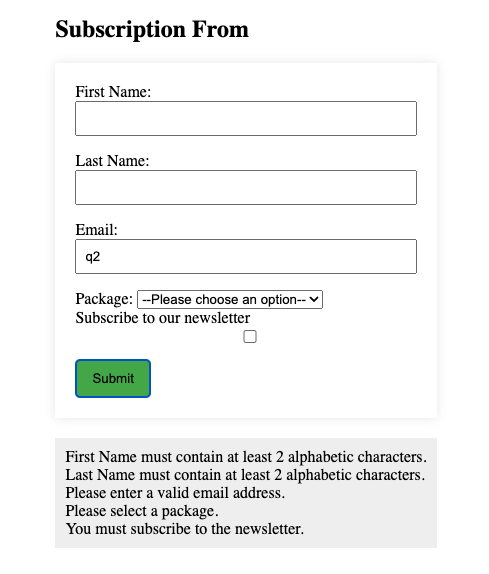

# Subscription Form
This is a simple **Subscription Form** designed to collect user information. 

## Features
 - It provides input check and validation, if any input not fulfill requirement, it pop up cooresponding error message

 - When all fileds filled successful, a complete sentence will show up with all information user filled in

## Technologies Used

- **HTML**: Used to made form structure
- **CSS**: Used for styling the form
- **JavaScript**: Handles validation and message show up logic

## Installation

